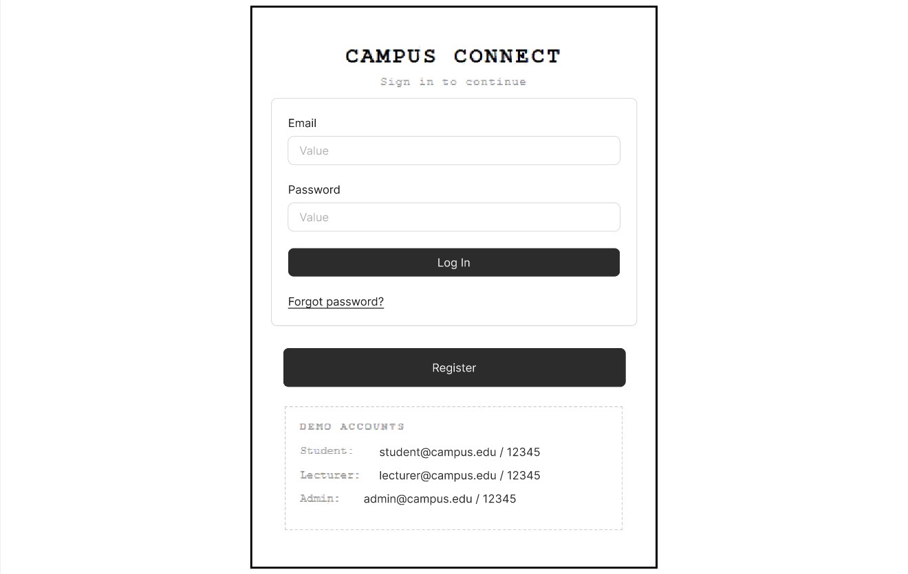
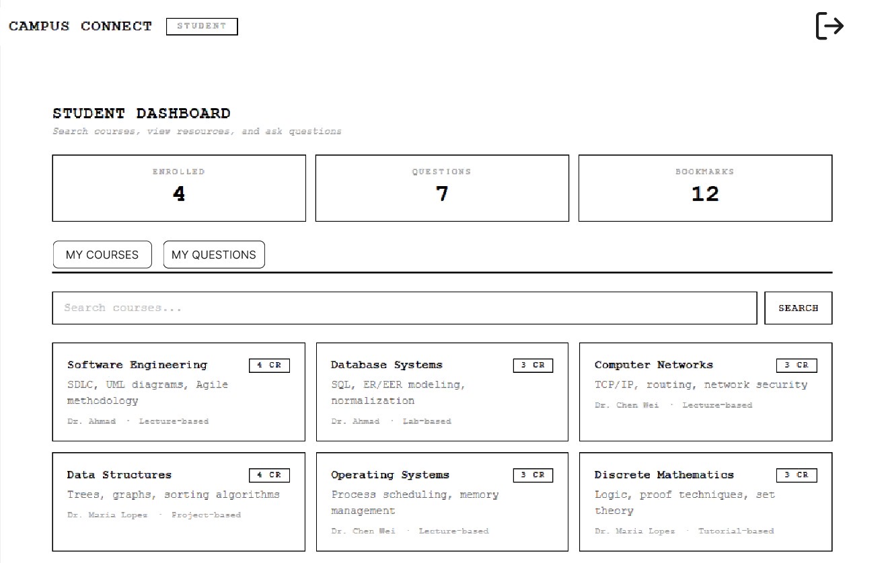
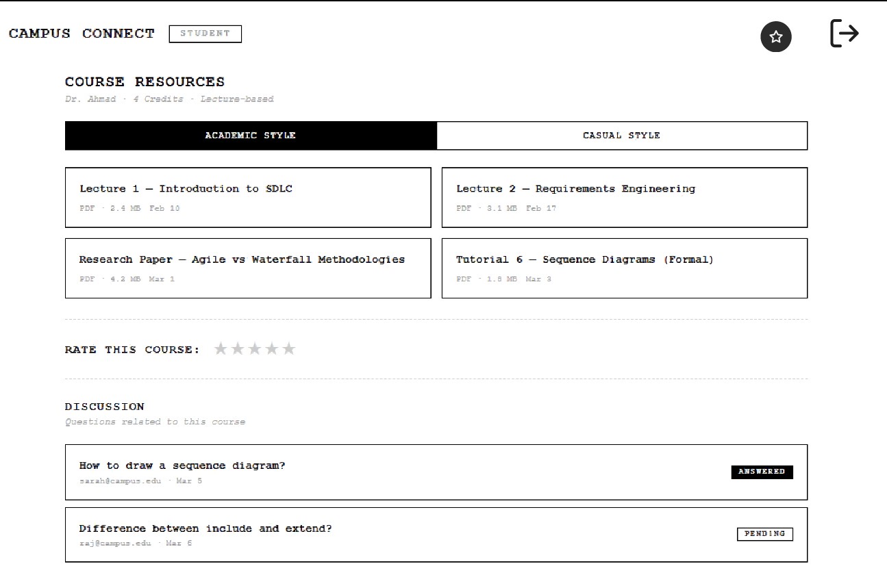
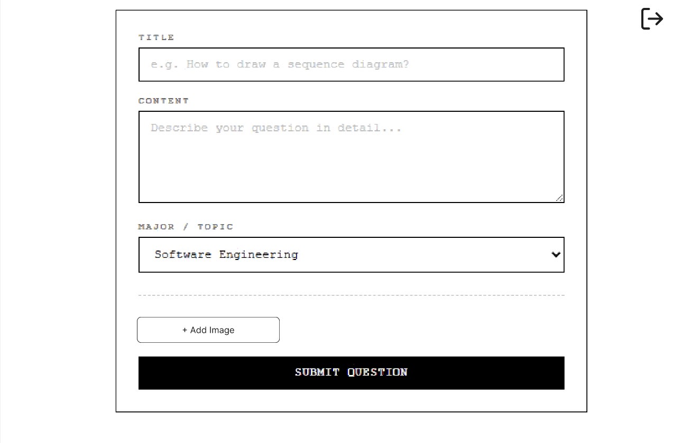
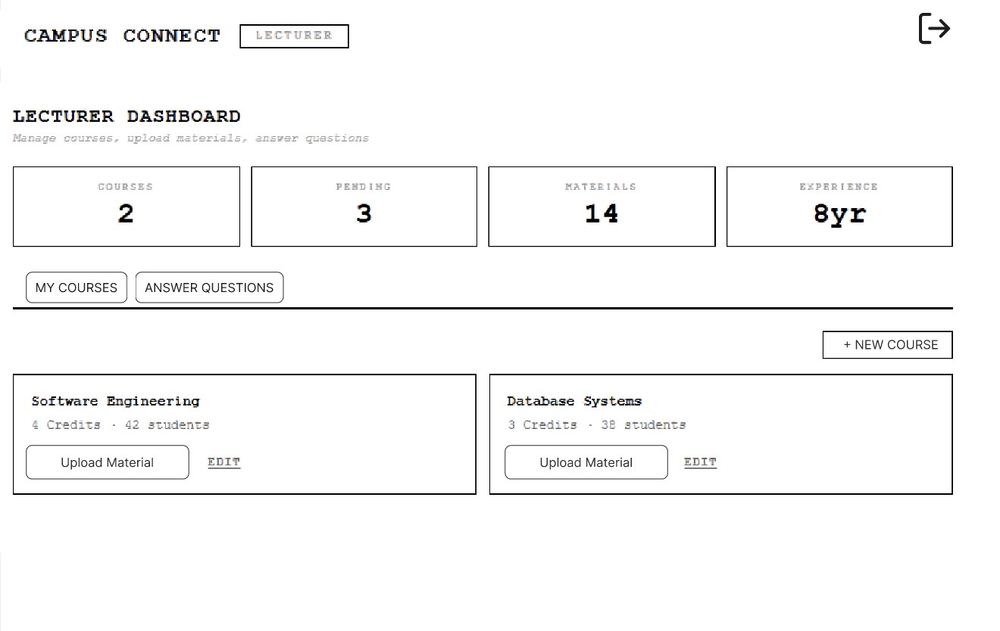
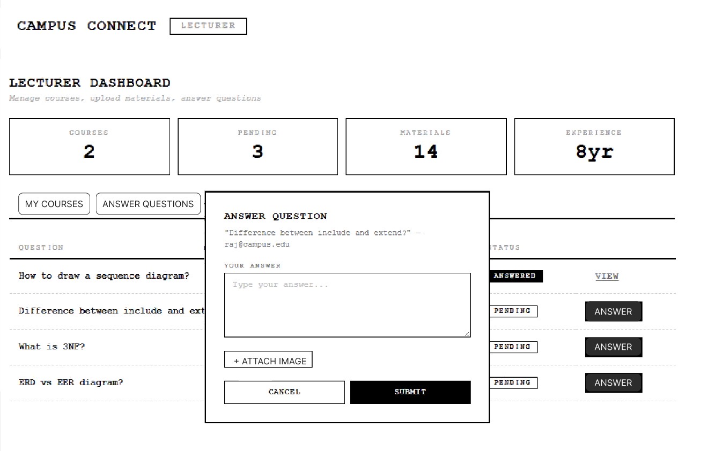
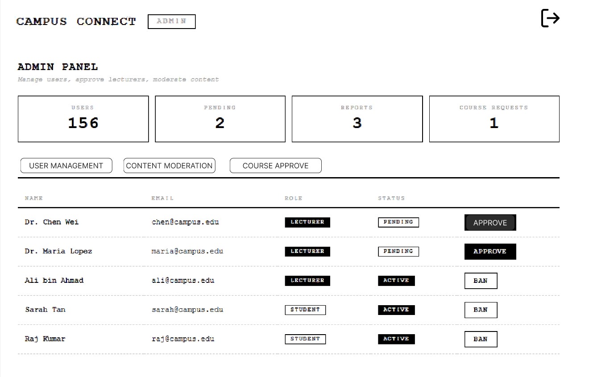
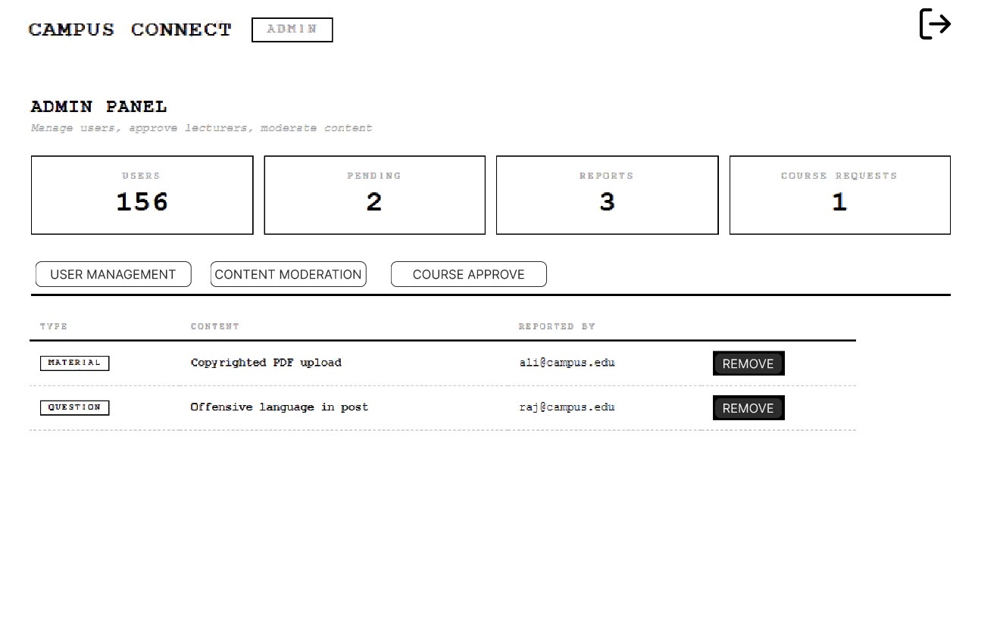
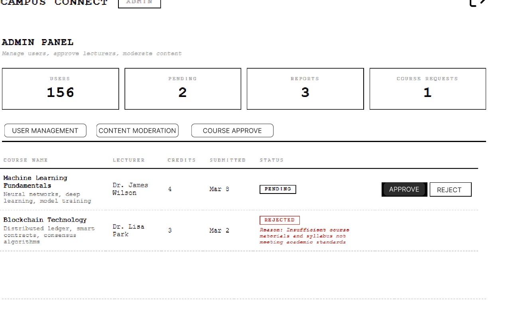

Figma Link:https://www.figma.com/proto/FAVmZlZoVXBGGFhZ8gjTG1/Untitled?node-id=30-2685&p=f&t=P6n4lnKz1txVTExf-0&scaling=min-zoom&content-scaling=fixed&page-id=0%3A1&starting-point-node-id=30%3A2272

Screenshot Demonstration

1. Login 

2. Student Dashboard 

3. Course View 

4. Student Submit Questions 

5. Lecturer Dashboards 

6. Lecturer Answer Questions 

7. Admin Panel 

8. Content Moderation 

9. Course Approval 
